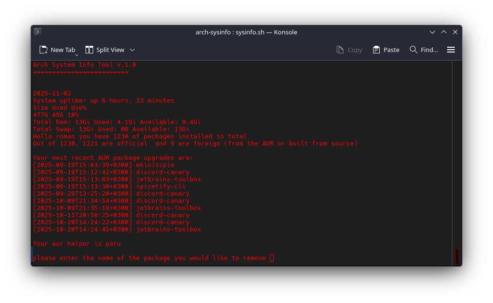

# Arch Sytem Info Tool
A bash-based system information and package management tool for Arch Linux and Arch based systems



## Features

 - **Package Statistics**: Display total installed packages separated by official repositories and foreign/AUR packages
- **System Monitoring**: Show system uptime, disk usage, and memory usage (RAM + Swap)
- **AUR Update Tracking**: Monitor recent AUR package updates from pacman logs
- **Smart Package Manager Detection**: Automatically detects and uses your installed AUR helper (paru, yay, or pacman)
- **Interactive Package Removal**: Safely remove packages with validation and confirmation prompts

## Why I built this
As a recent CachyOS user, coming from WIndows, I found myself frequently checking package counts and forgetting which packages came from the AUR versus official repositories. This tool provides a quick dashboard to see all relevant system information at a glance and helps manage packages more efficiently.

## Installation

### Prerequisites

- Arch Linux or Arch-based distribution (tested on CachyOS)
- Bash shell
- pacman package manager
- Optional: paru or yay for AUR package management

### Setup

1. Clone the repository:
```bash
git clone https://github.com/roman11x/arch-sysinfo.git
cd arch-sysinfo
```

2. Make the script executable:
```bash
chmod +x sysinfo.sh
```

3. Run the tool:
```bash
./sysinfo.sh
```

## Usage

Simply run the script to see your system information dashboard:
```bash
./sysinfo.sh
```

The tool will display:
- Current date and system uptime
- Disk usage statistics
- Memory usage (RAM and Swap)
- Package counts (official vs foreign/AUR)
- Recent AUR package updates
- Detected AUR helper

After displaying the information, you'll be prompted to optionally remove a package. The tool validates that the package exists before attempting removal.

## Technical Details

- **Language**: Bash
- **Package Detection**: Uses `pacman -Qn` for official packages and `pacman -Qm` for foreign packages
- **Text Processing**: Utilizes `awk` for parsing command output
- **AUR Helper Detection**: Checks for paru and yay, falls back to pacman
- **Package Validation**: Verifies package existence before removal attempts

## What I Learnt

This project helped me develop skills in:
- Bash scripting fundamentals 
- Text processing with `awk` and command pipelines
- Linux system information gathering (`free`, `df`, `uptime`, pacman logs)
- User input handling and validation
- Error handling and edge case management
- Git workflow and version control

## Future Improvements (Phase 2)

Potential enhancements for future versions:
- Interactive TUI with `dialog` or `whiptail`
- Multi-select package removal
- Package search functionality
- Dependency tree visualization before removal
- Export reports to files
- Color-coded output for better readability
- Configuration file support

## Author

Roman Nizker - Third year Information Systems student at Haifa University

## License

This project is open source and available for educational purposes.
